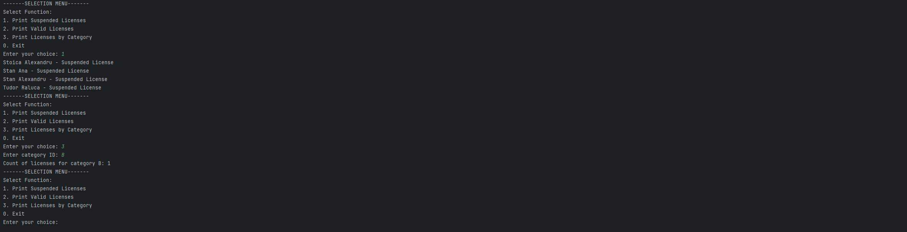
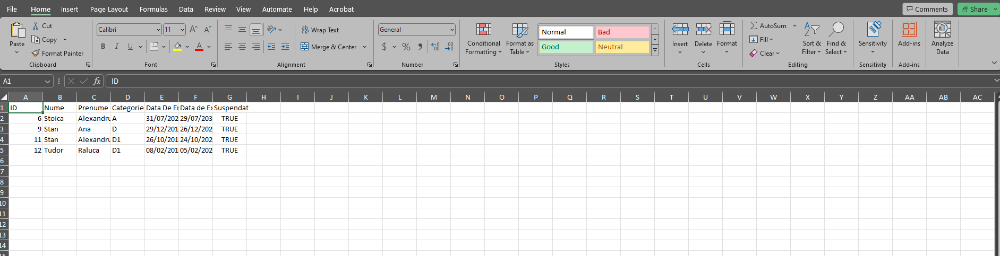

# YONDER DEVOPS ASSESSMEMT

## Overview 

This repository contains, besides the python application itself, two directories:
   
   1. The [Questions]() directory where you can find the [Questions.txt]() file inside of which I answered the 10 theoretical questions.
   
   2. The [Reports]() directory where I stored the reports of the 3 operations defined in the requirements.

## Preview

#### How the program works in the console


#### Excel preview


## Getting Started

### Prerequisites
- [Docker Desktop](https://www.docker.com/products/docker-desktop/)
- [Python](https://www.python.org/downloads/)

### Installing
1. Clone the repository:
   ```bash
   git clone https://github.com/RadAntonio/YonderDevOpsTesr.git
   ```
2. After you installed Docker for your machine open the terminal and pull the container:
   ```bash
   docker pull yondermakers/yonder-devops-tech-assessment:latest
   ```
3. Run it on localhost:
   ```bash
   docker run -p 30000:8080 yondermakers/yonder-devops-tech-assessment:latest
   ```
4. Install the required packages:
   ```bash
   pip install -r requirements.txt
   ```
5. Open your preferred IDE
6. Run:
   ```bash
   Main.py
   ```